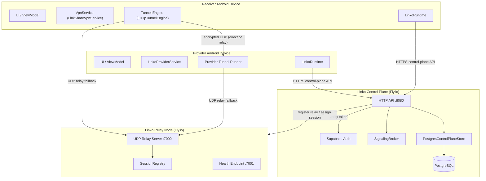

# System Context Architecture — Linko

## Overview

Linko is composed of three primary runtime environments:
- **Android devices** (Provider and Receiver)
- **Linko Control Plane** (backend API + Supabase auth)
- **Linko Relay Nodes** (UDP packet relay, Fly.io)

---

## Data Plane vs Control Plane

| Plane | What travels | Path |
|---|---|---|
| **Control** | Auth tokens, session requests, approvals, signaling, usage counters | HTTPS to Control Plane API |
| **Data** | Encrypted IP packets (Receiver traffic forwarded through Provider) | Direct UDP or Relay UDP |

The Control Plane **never sees** user traffic content. It only sees session metadata.

---

## Component Inventory

### Android App (`android/`)
| Component | Responsibility |
|---|---|
| `LinkoRuntime` | Orchestrates all API calls and session lifecycle |
| `LinkoStateMachine` | Tracks session state (idle → requesting → approved → connected → disconnected) |
| `LinkoSignalingClient` | Polls signaling endpoint for offer/answer/ICE messages |
| `LinkoRealtimeManager` | Supabase Realtime WebSocket for live presence |
| `LinkoPresenceManager` | Provider online/offline state |
| `FullIpTunnelEngine` | IP packet capture, routing, and tunnel transport |
| `EncryptedDatagramTunnel` | AES-GCM encrypted UDP datagram transport |
| `LinkShareVpnService` | Android VpnService — captures Receiver's traffic |
| `LinkoProviderService` | Android foreground service — runs Provider tunnel loop |
| `TunnelCoordinator` | Coordinates between VpnService and tunnel engine |
| `LinkoAuth` | Supabase-backed auth (sign-up, sign-in, token refresh) |
| `LinkoDeviceIdentity` | Permanent device ID (persisted in EncryptedSharedPreferences) |
| `LinkoRequestKey` | Temporary per-session request key |

### Backend Control Plane (`backend/`)
| Component | Responsibility |
|---|---|
| `server.ts` | HTTP request router — all API endpoints |
| `auth.ts` | Device JWT issue + verify |
| `signaling.ts` | Offer/answer/ICE message broker (polling-based) |
| `tunnel.ts` | UDP tunnel endpoint (optional relay fallback) |
| `postgres-store.ts` | PostgreSQL-backed device/session/usage store |
| `store.ts` | In-memory fallback store (dev/test only) |
| `rate-limiter.ts` | Token-bucket rate limiting per device |
| `usage.ts` | Session byte counter recording and quota enforcement |
| `admin.ts` | Admin routes: list/revoke devices, sessions |
| `abuse.ts` | Abuse detection: repeated rejections, usage spikes |
| `relay-coordinator.ts` | Relay node registry and session assignment |
| `notifications.ts` | FCM push notification dispatch |
| `privacy.ts` | GDPR data export and account deletion |
| `observability.ts` | Structured logging, request timing, /metrics |

### Relay (`relay/`)
| Component | Responsibility |
|---|---|
| `relay-server.ts` | UDP packet relay: auth, forward, bandwidth tracking |
| `session-registry.ts` | In-memory session→key map with TTL |
| `health.ts` | HTTP health check and Prometheus metrics |

---

## API Contract Index

All endpoints require `Authorization: Bearer <device-jwt>` unless noted.

| Method | Path | Auth | Description |
|---|---|---|---|
| GET | `/health` | None | Service health check |
| POST | `/v1/auth/signup` | None | Create account + auto-confirm + return session |
| POST | `/v1/devices/register` | Supabase JWT | Register device, receive device JWT |
| POST | `/v1/devices/presence` | Device JWT | Heartbeat / update lastSeenAt |
| GET | `/v1/provider/requests` | Device JWT (provider) | List pending connection requests |
| GET | `/v1/providers/user/:userId` | Device JWT | Get online provider for a friend |
| POST | `/v1/sessions` | Device JWT | Create connection request |
| GET | `/v1/sessions/:id` | Device JWT | Get session state |
| POST | `/v1/sessions/:id/transition` | Device JWT | Transition session state |
| GET | `/v1/sessions/:id/tunnel` | Device JWT | Get tunnel endpoint + key |
| POST | `/v1/sessions/:id/signaling/ticket` | Device JWT | Get signaling ticket |
| POST | `/v1/sessions/:id/signaling` | Device JWT | Publish signal (offer/answer/ICE) |
| GET | `/v1/sessions/:id/signaling` | Device JWT | Drain signals |
| PATCH | `/v1/sessions/:id/usage` | Device JWT | Report bytes up/down |
| GET | `/v1/account/export` | Device JWT | GDPR data export |
| DELETE | `/v1/account` | Device JWT | Delete account and all data |
| GET | `/v1/admin/sessions` | Admin JWT | List all sessions |
| GET | `/metrics` | None (internal) | Prometheus metrics |

---

## Key Architectural Constraints

1. **Separation of concerns** — Control plane and data plane are strictly separated. The control plane API never proxies user traffic.
2. **Explicit consent** — No session can enter `approved` state without an explicit Provider action. This is enforced server-side.
3. **Short-lived credentials** — Session tunnel keys are generated per-session and revoked on termination.
4. **Relay as fallback** — Direct UDP path is always attempted first. Relay is assigned only when the control plane detects NAT traversal is needed.
5. **Stateless relay** — Relay nodes hold only in-memory session state. They can be restarted at any time; the session will reconnect via the control plane.
6. **Horizontal scaling** — Backend is stateless (all state in PostgreSQL). Multiple backend instances can run behind a load balancer. Relay nodes are independently scalable.
