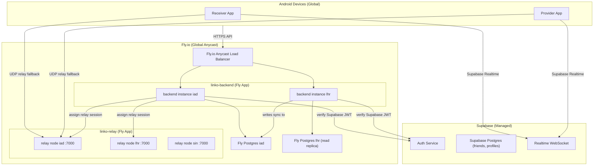

# Deployment Topology — Linko

## Production Stack

| Service | Platform | Instance type | Region |
|---|---|---|---|
| Backend control plane | Fly.io | `shared-cpu-1x` 256 MB | Primary: `iad` (US-East), secondary: `lhr` (London) |
| Relay node(s) | Fly.io | `shared-cpu-1x` 512 MB | `iad`, `lhr`, `sin` (Singapore) |
| PostgreSQL | Fly.io Postgres | `shared-cpu-1x` 1 GB | `iad` (primary) + read replica `lhr` |
| Auth | Supabase (managed) | Managed | Global CDN |
| Android app | Google Play Store | N/A | Global |

---

## Topology Diagram



---

## Network Port Map

| Service | Protocol | Port | Exposure |
|---|---|---|---|
| Backend API | HTTPS | 443 (via Fly proxy) | Public |
| Backend API (internal) | HTTP | 8080 | Internal only |
| Relay UDP | UDP | 7000 | Public (Fly anycast) |
| Relay health | HTTP | 7001 | Internal / monitoring only |
| PostgreSQL | TCP | 5432 | Private network only |

---

## Environment Configuration

### Backend (`backend/.env.example` / Fly secrets)

```
NODE_ENV=production
PORT=8080
LINKO_DATABASE_URL=postgres://...
LINKO_JWT_SECRET=<min-32-byte-random-string>
SUPABASE_URL=https://<project>.supabase.co
SUPABASE_PUBLISHABLE_KEY=sb_publishable_...
SUPABASE_SECRET_KEY=sb_secret_...
TUNNEL_HOST=relay-iad.fly.dev
TUNNEL_PORT=7000
FCM_SERVER_KEY=<firebase-server-key>
```

### Relay (`relay/.env.example` / Fly secrets)

```
PORT=7001
UDP_PORT=7000
LINKO_CONTROL_PLANE_URL=https://linko-backend.fly.dev
RELAY_SECRET=<shared-secret-for-control-plane-relay-registration>
MAX_SESSIONS=1000
BANDWIDTH_LIMIT_BYTES_PER_SESSION=1073741824
```

### Android (`gradle.properties` / CI secrets)

```
LINKO_CONTROL_PLANE_URL=https://linko-backend.fly.dev
LINKO_SUPABASE_URL=https://<project>.supabase.co
LINKO_SUPABASE_PUBLISHABLE_KEY=sb_publishable_...
```

---

## DNS

| Hostname | Points to | Purpose |
|---|---|---|
| `api.linko.app` | Fly.io backend anycast | Control plane API |
| `relay-iad.linko.app` | Fly.io relay iad | US relay node |
| `relay-lhr.linko.app` | Fly.io relay lhr | EU relay node |
| `relay-sin.linko.app` | Fly.io relay sin | APAC relay node |

---

## Deployment Sequence (First Production Deploy)

1. Create Fly.io account and install `flyctl`
2. `fly postgres create --name linko-pg --region iad`
3. `cd backend && fly launch --name linko-backend --region iad --no-deploy`
4. `fly secrets set LINKO_JWT_SECRET=... SUPABASE_SECRET_KEY=... ...`
5. Run all DB migrations: `fly ssh console -a linko-backend --command "node dist/db-verify.js"`
6. `fly deploy -a linko-backend`
7. `cd relay && fly launch --name linko-relay --region iad --no-deploy`
8. `fly secrets set RELAY_SECRET=... LINKO_CONTROL_PLANE_URL=...`
9. `fly deploy -a linko-relay`
10. Scale relay to additional regions: `fly scale count 1 --region lhr,sin`
11. Verify: `curl https://api.linko.app/health`
